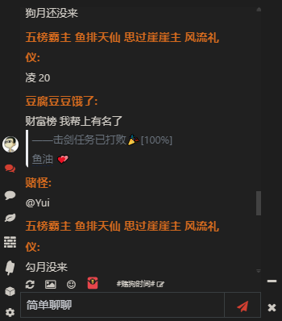

# 摸鱼派客户端 Mini 主题

支援 1.2.2 版本以上[摸鱼派客户端](https://github.com/imlinhanchao/fishpi-desktop)</p>

## 安装

查看客户端设置界面的**扩展目录**，在该目录下执行:

```shell
git clone https://github.com/imlinhanchao/fishpi-theme-mini.git
```

或下载 Code 压缩档，解压到该目录。

重新进入设置界面，主题栏位下拉选择 `Mini主题` 即可。

## 预览

  
